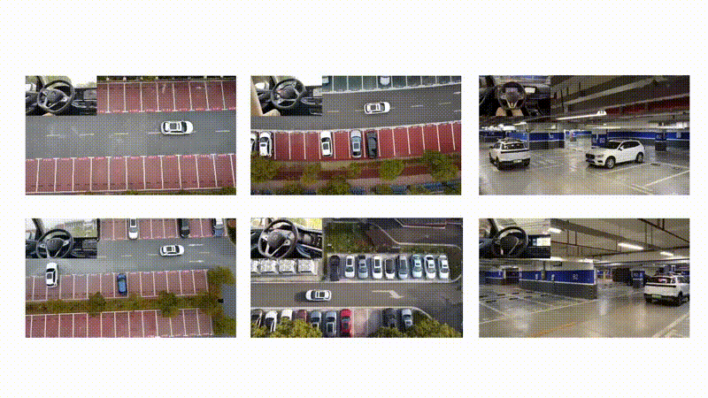

# ParkingE2E

## ParkingE2E: Camera-based End-to-end Parking Network, from Images to Planning
Autonomous parking is a crucial task in the intelligent driving field.
Traditional parking algorithms are usually implemented using rule-based schemes.
However, these methods are less effective in complex parking scenarios due to the intricate design of the algorithms.
In contrast, neural-network-based methods tend to be more intuitive and versatile than the rule-based methods.
By collecting a large number of expert parking trajectory data and emulating human strategy via learning-based methods, the parking task can be effectively addressed.
We employ imitation learning to perform end-to-end planning from RGB images to path planning by imitating human driving trajectories.
The proposed end-to-end approach utilizes a target query encoder to fuse images and target features, and a transformer-based decoder to autoregressively predict future waypoints.

**Video:**



Supplementary video material is available at: [\[Link\]](https://youtu.be/urOEHJH1TBQ).

**Related Papers:**

- Changze Li, Ziheng Ji, Zhe Chen, Tong Qin and Ming Yang. "ParkingE2E: Camera-based End-to-end Parking Network, from Images to Planning." 2024 IEEE/RSJ International Conference on Intelligent Robots and Systems (IROS). IEEE, 2024. [\[Link\]](./resource/iros2024_parking.pdf)

- Yunfan Yang, Denglon Chen, Tong Qin, Xiangru Mu, Chunjing Xu, Ming Yang. "E2E Parking: Autonomous Parking by the End-to-end Neural Network on the CARLA Simulator." 2024 IEEE Intelligent Vehicles Symposium (IV). IEEE, 2024. [\[Link\]](https://ieeexplore.ieee.org/abstract/document/10588551)


## 1. Prerequisites
Ubuntu 20.04, CUDA, ROS Noetic and OpenCV 4.


## 2. Setup
Clone the code:
```Shell
git clone https://github.com/ChauncyLeee/e2e_parking_imitation.git
cd e2e_parking_imitation/
```

Install virtual environment:
```Shell
conda env create -f environment.yml
```

Setup interface:
```shell
conda activate ParkingE2E
PARKINGE2E_PYTHON_PATH=`which python`
cd catkin_ws
catkin_make -DPYTHON_EXECUTABLE=${PARKINGE2E_PYTHON_PATH}
source devel/setup.bash
```


## 3. Run

#### Download pretrained model and test data:
Firstly, you should download the [pretrained model](https://drive.google.com/file/d/1rZ4cmgXOUFgJDLFdnvAI6voU9ZkhsmYV/view?usp=drive_link) and [test data](https://drive.google.com/file/d/11kA-srYa6S30OqyCdyg3jGNZxBMsUHYC/view?usp=drive_link). Then, you need to modify inference config `model_ckpt_path` in `./config/inference_real.yaml`.

#### Run driven program:
```Shell
roslaunch core driven_core.launch
```

When the command is executed for the first time, a progress bar will appear (used to calculate the distortion map). After the four (fisheye camera) progress bars are completed, subsequent operations can be carried out.

#### Start inference using E2E algorithm:
```shell
conda activate ParkingE2E
python ros_inference.py
```
When the command is executed for the first time, the `EfficientNet` pretrained model will be downloaded.

#### Run test demo:
```shell
unzip demo_scene.zip
cd demo_scene
# scene_index = 1, 2, 3, 4, 5, 6, 7. For example: sh ./demo.sh 1
sh ./demo.sh ${scene_index}
```

In rviz, you can also select the parking trarget using `2D nav goal` on the rviz pannel.


## 4. Train
We provide the [demo rosbag](https://drive.google.com/file/d/1jIG1iRMeW9XXdWP7eEJKnZP1gC0xvG7o/view?usp=drive_link) to create a mini dataset and train a model.
#### Generate dataset
First, you need to create a dataset.
```
python toolkit/dataset_generation.py --bag_file_path ${DEMO_BAG_PATH} --output_folder_path ./e2e_dataset
```
If you use your own rosbag, please confirm the rosbag topic in `./catkin_ws/src/core/config/params.yaml` and modify the camera configuration.

#### Train your model
```Shell
python train.py --config ./config/training_real.yaml
```
You can modify the training configuration in `./config/training_real.yaml`.


## 5. License
The source code is released under [GPLv3](http://www.gnu.org/licenses/) license.